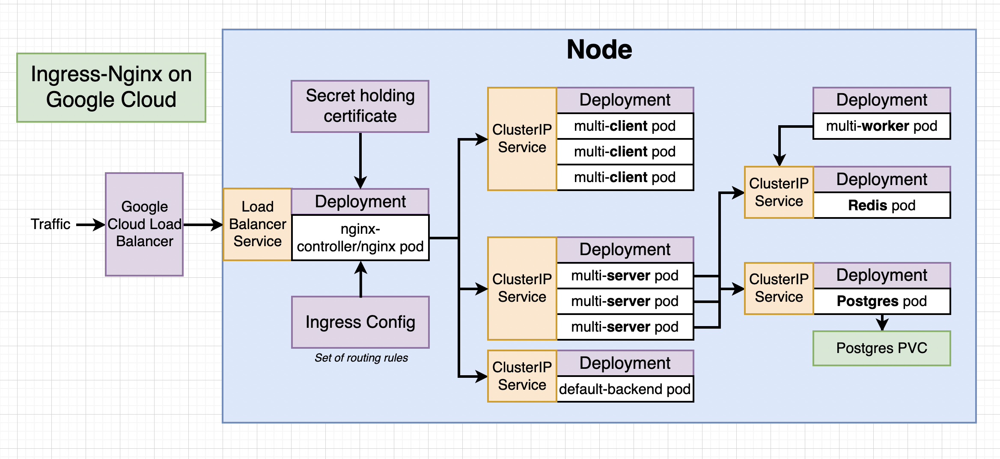

# vandersangen/multi-k8s-template

This repo is just a (boiler)template for a multi-container deployed application towards a 
k8s cluster (Google Cloud). However, this is (very probably) grossly applicable to other cloud providers.

The purpose of this template is that this setup is applicable to most workplaces where (micro)services are being introduced.
This template can be treated as a boilerplate template for projects that are migrating towards a containerized
(infra)architecture.

'All' you need to do is replace the `multi-*` containers with the containers that are being created in the
place where the migration is started. 

After the correct Docker images are built successfully, the setup here can be reconfigured (port- and path-wise). 
The rests is (very probably) easy (re)configurable. 

A HTTPS certificate is automatically requested. Only thing to check if it automatically is renewed.
If not, a redeploy would.
Check [Required to execute in Google Cloud OR on k8s cluster](#required-to-execute-in-google-cloud-or-on-k8s-cluster)
toe see configuration is needed to finish the setup.


## Detailed description

This project-template contains the following:
- Multiple `deployments` with 1 or more pods
- The `multi-client`, `multi-server`, `postgres`, and `redis` pods are available through
 `ClusterIpServices`
 - Expect the `multi-worker` pod. This pod is triggered on the `on('message')` event of `redis`



## Required to execute in Google Cloud OR on k8s cluster

```
# Set/authorize gcloud with k8s cluster in console
$ gcloud config set compute/zone <your-gke-clusterzone-here>
$ gcloud container clusters get-credentials <your-multi-k8s-cluster>

# Otherwise when configuring a on-premise k8s cluster. Run below commands on cluster 
$ kubectl create serviceaccount <username>
$ kubectl create token <username>

# Copy (newly generated section of) kube-config to external device
# Still on cluster
$ cat <kube-config file
# Copy server, context and (new) user and paste in external device kube-config file
# Finish with setting the token on the external device's newly added user
$ kubectl config set-credentials <username> --token=<token>
   
# Install ingress-nginx
$ helm repo add ingress-nginx https://kubernetes.github.io/ingress-nginx
$ helm install my-release ingress-nginx/ingress-nginx

# Install certmanager (certbot-tool)
$ helm repo add jetstack https://charts.jetstack.io
$ helm repo update
$ helm install cert-manager jetstack/cert-manager --namespace cert-manager --create-namespace --version v1.8.0 --set installCRDs=true

# Add external cluster (other context) to local
$ kubectl config set-cluster <cluster-name> --server=http://<master-ip>:<port> --api-version=v1
$ kubectl config use-context <cluster-name>

```

To authorize GitHub Actions with our Google Cloud Cluster (and get the `${{ secrets.GKE_SA_KEY }}` out of Google Cloud;

- Create a Service Account in the Google Cloud project
- Assign the `Kubernetes Engine Admin` role
- 'Manage keys' of the newly created Service Account
- Create new key (JSON)
- And assign the JSON value to the secret `GKE_SA_KEY`

More detailed description here: https://www.udemy.com/course/docker-and-kubernetes-the-complete-guide/learn/lecture/25408376#questions/17305086

## License

This project is licensed under the [NAME HERE] License - see the LICENSE.md file for details
